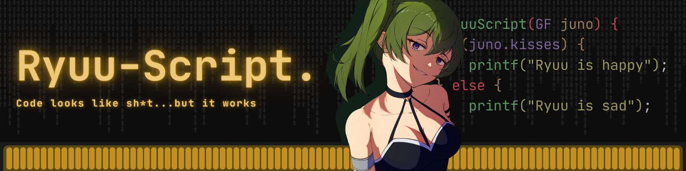

# It's Ryuu, at your service 🙃
 

**Aspiring Back-End Software Developer** | Computer Science Student at University of San Carlos

Me write code, me get it wrong, me fix code, still no work, me wonder..... Me see that I forgot to put a goddamn semi-colon in line 34 😤
  

## [ Education ]
 

- **(2023 - 2025)** [iAcademy Cebu] Bachelor of Science in Computer Science -- Major in Software Engineering
- **(2026 - ongoing)** [University of San Carlos] Bachelor of Science in Computer Science
 

## [ Technical Skills ]
 

### Primary Languages

  

- **Main:** C
- **Experienced:** C++, Java, JavaScript, PHP, Flutter
 

## [ Current Focus ]
  

- Deepening my understanding of back-end technologies and system design
- Continuously improving my programming fundamentals
- Building projects that prioritize functionality and reliability
- Studying Computer Science at USC
 

## [ Beyond Code ]
 

 When I'm not coding, you can find me:   
  
  
  
  
  

 

  <i>"The lion does not concern himself with the most barebones-looking webpage as long as it works correctly."</i>

