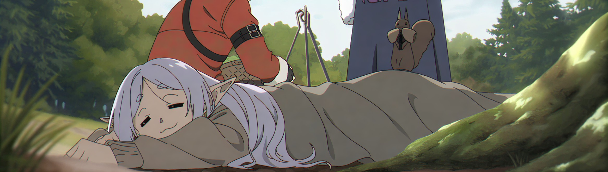

# It's Ryuu, at your service 🙃

**Aspiring Software Developer** | Computer Science Student at University of San Carlos  
I am a second-year CS student with a passion for earning money so I can have a roof over my head and afford groceries to prevent starving
 

## [ Education ] 
- **(2025 - ongoing)** 
   [University of San Carlos] Bachelor of Science in Computer Science

- **(2023 - 2025)** 
   [iAcademy Cebu] Bachelor of Science in Computer Science -- Major in Software Engineering

## [ Technical Skills ]
### Primary Languages

  

**Main:** C
 
**Experienced:** C++, Java, JavaScript, PHP

## [ Current Focus ]

- Passing my courses so I can graduate ASAP 🥱
- Learning several programming-related fields to figure out what I want to specialize in
- Connecting with like-minded people in my University (proceeds to only hang out with the same 3 people)

## [ Beyond Code ]
 

 When I'm not coding, you can find me:   
  
  
  
  
  

 

  <i>"The lion does not concern himself with the most barebones-looking webpage as long as it works correctly."</i>

